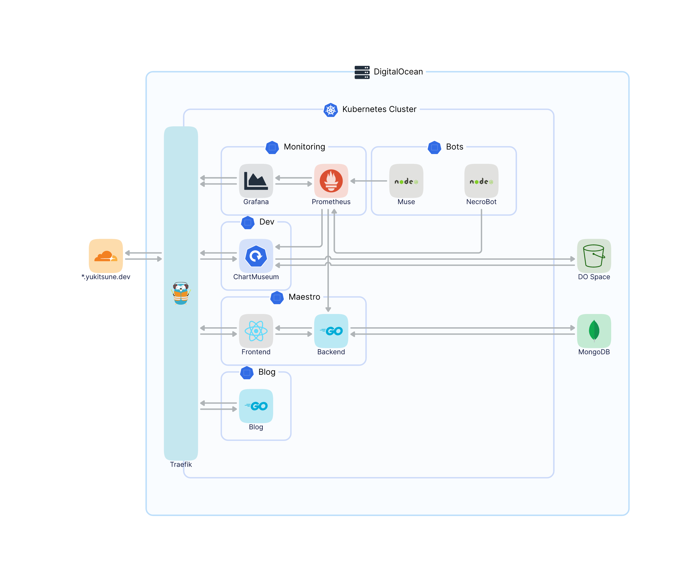

<h1 align="center">
  🏢 Infrastructure 🏗
</h1>

<h3 align="center">
  A collection of Kubernetes configuration files used to configure my public infrastructure.

  <!-- 
  
  
   -->
</h3>

# Diagram
